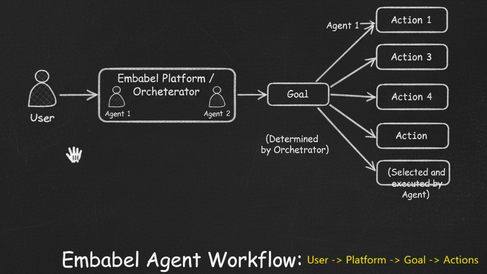
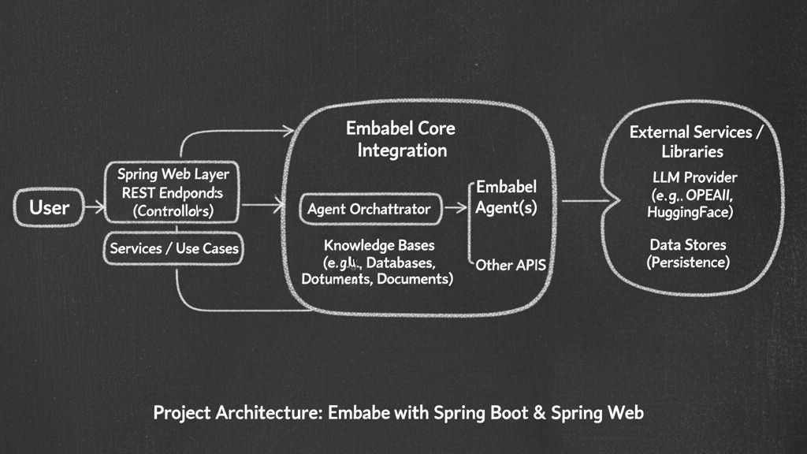

# Embabel Agent Framework Samples
embabel-demo offers sample projects demonstrating the Embabel Agent Framework for 
building Java applications using Spring, web, and shell integrations.

Embabel is a JVM-based agent framework that lets you build intelligent “agentic flows” 
by combining LLM (Large Language Model) calls with code, using planning, strong typing, 
and composition to build safe, testable AI applications. Here is how for the first time I tried my hands on it.

**The Embabel workflow:**

- Say, A User initiates a request.

- This request is received by the Embabel system, which may involve an Orchestrator or multiple Agents.

- An Agent (or a sequence of Agents) is selected to handle the request.

- The chosen Agent then interprets the user's request to define a clear Goal.

- To achieve this Goal, the Agent intelligently selects and executes a series of Actions from its available capabilities (e.g., Action 1, Action 2, etc.) until the Goal is accomplished and a response can be provided back to the user.



Sample projects using the [Embabel](https://github.com/embabel) Agent Framework.

## Prerequisites
* JDK 21+
* Docker and Docker Compose
* I already have downloaded few LLMs locally, e.g. => Ollama3.2:latest (Run LLMs either docker or locally)

- In my system Powershell:
```
C:\Users\abcha> ollama list
NAME                        ID              SIZE      MODIFIED
llama3.2:latest             a80c4f17acd5    2.0 GB    3 months ago
mxbai-embed-large:latest    468836162de7    669 MB    6 months ago
deepseek-r1:8b              28f8fd6cdc67    4.9 GB    8 months ago

C:\Users\abcha>    ollama run llama3.2:latest
>>> Send a message (/? for help)
```

## Project Architecture: `embabel-demo` with Spring Web



**Explanation of the Diagram:**

1.  **User/Client:** Initiates a request through a web browser or API client.
2.  **Spring Web Layer (Controller):** This is your `@RestController` in the Spring Boot application (e.g., in your `embabel-webapp-demo`). It receives the HTTP request and handles the Spring-specific web logic.
3.  **Application Service/Use Case:** The Controller delegates the core logic to a Spring `@Service` or similar component.
4.  **Embabel Agent Platform (Core):**
    * The Service injects and interacts with an **Embabel Agent** or the **Embabel Platform** itself.
    * This is the high-level framework that orchestrates the AI logic.
5.  **Agent Orchestration (GOAP):** Embabel uses a deterministic planner (GOAP - Goal-Oriented Action Planning) to dynamically decide the steps needed to achieve the user's goal.
6.  **Agent Actions:** The planner chains together various actions, which can include:
    * **LLM Interaction:** Sending prompts to the configured Large Language Model (e.g., Ollama/Llama3.2, as you mentioned in your README).
    * **Tools/Services:** Calling Spring-managed `@Action` methods within your application (the "code" side of the agent).
    * **Knowledge Bases (RAG):** Accessing external data sources if your agent is configured for Retrieval-Augmented Generation (RAG).
7.  **External Components:**
    * **LLM Provider (Ollama):** The actual model (like Llama3.2) that performs the AI computation.
8.  **Response:** The final, processed output from the Agent is returned through the Spring Web layer back to the User/Client as an HTTP response.


## References
* [Embabel](https://github.com/embabel)
* [Embabel Agent Framework](https://github.com/embabel/embabel-agent)
* [Official Embabel Agent Framework Samples](https://github.com/embabel/embabel-agent-examples)
* [Embabel User Guide](https://docs.embabel.com/embabel-agent/guide/0.1.2-SNAPSHOT/)
* [Rod Johnson Medium Blog](https://medium.com/@springrod)
